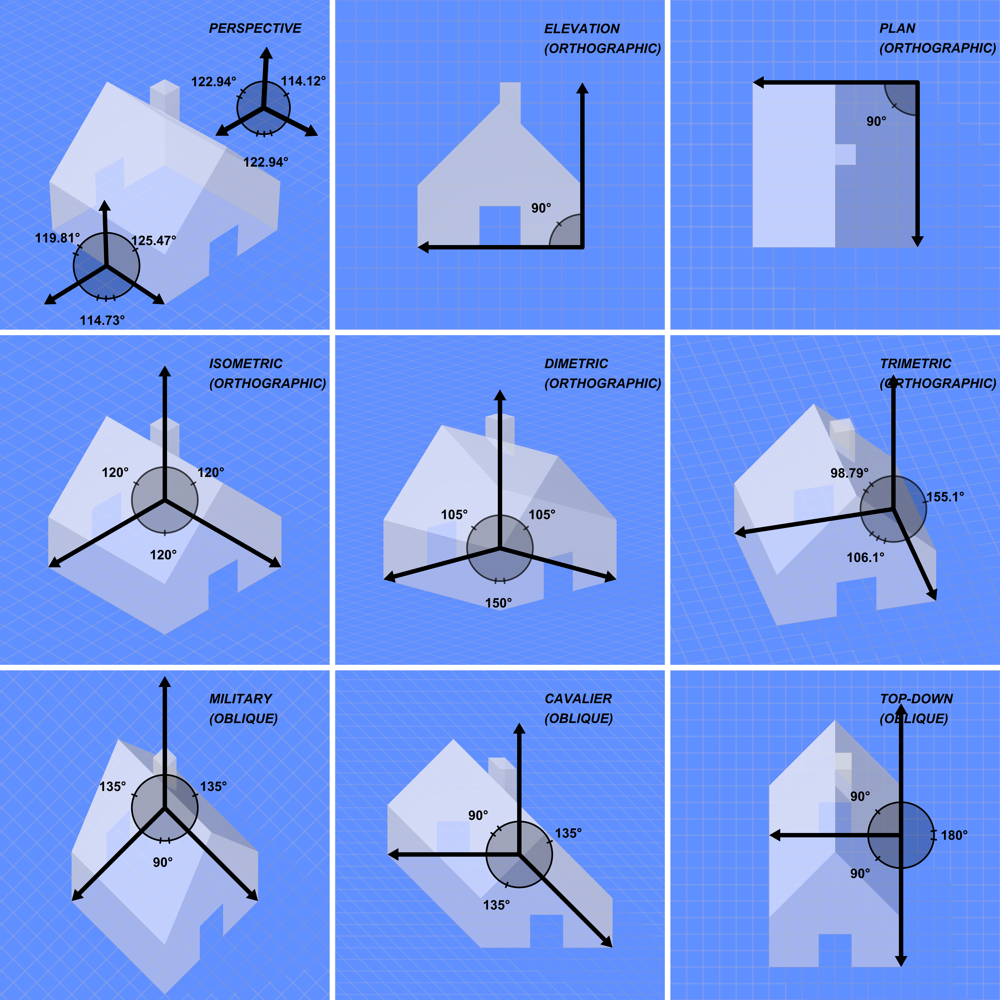

# Triangles on Web Ch4 Orthographic Projection

From this part, we will go into the world of 3D graphics. We will learn about the basic concepts of 3D rendering.

But before building the simulation, we have a lot to learn- perspective and lighting, to be specific.

In this part, we will learn about perspective. We will learn how to project 3D objects onto a 2D screen, and how to create a perspective camera.

Of course, a simpler way would be to use orthographic projection, which we will also learn about.

Perspective is a projection method that provide verisimilitude to the 3D world. It is the most common projection method in computer graphics. But previously, we learnt that NDC has three axis. So why do we need to project 3D objects onto a 2D screen?

The z axis of NDC is depth, not the distance from the camera. So, instead of the z-axis, it is more like a layer of the 3D world. The smaller z-axis will get prioritized in things like depth test.

## Orthographic Projection

Orthographic projection is a projection method that does not take perspective into account. That is, it does not make objects smaller as they go further away from the camera. This is useful for technical drawings, but not for realistic rendering.

Orthographic projection is a projection, that is, in a mathematical sense,

$$
view_{point} = orthographic( model_{point})
$$

Where `veiw_{point}` is the NDC point, and `model_{point}` is the 3D point. The `orthographic` function is the orthographic projection function.

Now let's see how we should implement the `orthographic` function.

### How Orthographic Projection Works

In orthographic projection, it is said that straight lines should remain straight, and parallel lines should remain parallel. Or alteratively, the transformation should be linear.


The left is the actual 3D model, also called the world space. The right is the 2D screen, also called the screen space.

Depending on the axis of the projected view, the orthographic projection can be divided into many types,



The first panel is perspective projection, which we will learn about later, it is for comparison.

The above image shows different kind of orthographic projections. But actually, there is only one kind of orthographic projection, if we treat their difference as parameters. That is, we can use a matrix to represent orthographic projection.

Now let's do the math.

### Using Matrix for Orthographic Projection

Before we do the math, we have two sets of axis to consider,

- The world axis, which is the actual 3D model.
- The screen axis, which is the actual 2D screen. x-axis is always horizontal, y-axis is always vertical.

They will later be noted with subscripts $w$ and $s$ respectively.

In orthographic projection, because during the transformation, the parallel lines should remain parallel, we can conclude that it is a linear transformation. That is, we can use a matrix to represent it.

To actually get the matrix, we need to know how the bases of the world axis are projected onto the screen axis. The different choices of the bases will result in different orthographic projections. But typically, y-axis will remain the same, and z-axis will be projected.

So, we can have the following matrix,

$$
r_s = M \cdot r_w
$$

Where $r_s$ is the screen space vector, $r_w$ is the world space vector, and $M$ is the orthographic projection matrix, varied based on the orthographic projection type.

Some typical orthographic projections are shown below,

#### Top View

In top view, the x-axis is projected onto the x-axis, and the z-axis is projected onto the y-axis.

$$  
\begin{bmatrix}
0 & 0 & 1 \\
0 & 1 & 0 \\
\end{bmatrix}
$$

This just puts z-axis onto the x-axis, then completely ignores the world x-axis.

#### Front View

In front view, the x-axis is projected onto the x-axis, and the y-axis is projected onto the y-axis.

$$
\begin{bmatrix}
1 & 0 & 0 \\
0 & 1 & 0 \\
\end{bmatrix}
$$

This just puts the world axis onto the screen axis, while ignoring the z-axis.

#### Isometric View

In isometric view, the projected x-axis, y-axis and z-axis will have a 120 degree angle between each other.

$$
\begin{bmatrix}
\cos(\frac{\pi}{6}) & 0 & -\cos(\frac{\pi}{6}) \\
-\sin(\frac{\pi}{6}) & 1 & -\sin(\frac{\pi}{6}) \\
\end{bmatrix}
$$

This is a bit more complicated, but it allows us to actually see the 3D object, instead of just one view.

#### Oblique View

In oblique view, the x-axis and y-axis stays, z-axis will be 45 degree to the x-axis, with a compression factor of $\frac{1}{2}$.

$$
\begin{bmatrix}
1 & 0 & \frac{1}{2\sqrt{2}} \\
0 & 1 & \frac{1}{2\sqrt{2}} \\
\end{bmatrix}
$$

This is the most traditional orthographic projection, and is used in technical drawings.

### Show a Cube with Orthographic Projection

Now, let's recapitulate on how to setup WebGPU.

First, get an adapter, then request a device.

```typescript
const requestDevice = async (): Promise<[GPUAdapter, GPUDevice] | null> => {
    const adapter = await navigator.gpu.requestAdapter();
    if (!adapter) {
        console.error('WebGPU not supported');
        return null;
    }
    const device = await adapter.requestDevice();
    console.log(device);
    return [adapter, device];
}
```

Then, we need to get the canvas and its context.

```typescript
const getContext = async (device: GPUDevice): Promise<[GPUCanvasContext, GPUTextureFormat]> => {
    const canvas = document.getElementById('app') as HTMLCanvasElement;
    const context = canvas.getContext("webgpu")!;
    const canvasFormat = navigator.gpu.getPreferredCanvasFormat();
    context.configure({
        device: device,
        format: canvasFormat,
    });
    return [context, canvasFormat];
}
```

Then, we need a shader module. Like we previously discussed, the transformation of Orthographic Projection is a point-wise operation, so we only need a vertex shader. We need to perform matrix multiplication in the shader.

```typescript
const get_shader = async (device: GPUDevice): Promise<GPUShaderModule> => {
    return device.createShaderModule({
        label: "sm",
        code: `
        @vertex
        fn vertexMain(@location(0) position: vec3<f32>) -> vec4<f32> {
            var projection: mat3x2<f32> = mat3x2<f32>(
                vec2<f32>(1.0, 0.0),
                vec2<f32>(0.0, 1.0),
                vec2<f32>(0.3535533906, 0.3535533906)
            );
            return vec4<f32>(projection * position, 0.0, 1.0);
        }

        @fragment
        fn fragmentMain() -> vec4<f32> {
            return vec4<f32>(0.0, 0.0, 1.0, 1.0);
        }
        `,
    })
}
```

Here we used the oblique view matrix, which is the most traditional orthographic projection matrix. We also used a blue color for the cube.

Then, the vertex buffer,

```typescript

const get_vertices = (device: GPUDevice): [GPUBuffer, GPUVertexBufferLayout] => {
    // cube
    // use triangle
    const vertices = new Float32Array([
        // xy
        1.0, 0.0, 0.0,
        0.0, 1.0, 0.0,
        0.0, 0.0, 0.0,

        1.0, 0.0, 0.0,
        0.0, 1.0, 0.0,
        1.0, 1.0, 0.0,

        1.0, 0.0, 1.0,
        0.0, 1.0, 1.0,
        0.0, 0.0, 1.0,

        1.0, 0.0, 1.0,
        0.0, 1.0, 1.0,
        1.0, 1.0, 1.0,
        // yz
        0.0, 1.0, 0.0,
        0.0, 0.0, 1.0,
        0.0, 0.0, 0.0,

        0.0, 1.0, 0.0,
        0.0, 0.0, 1.0,
        0.0, 1.0, 1.0,

        1.0, 1.0, 0.0,
        1.0, 0.0, 1.0,
        1.0, 0.0, 0.0,
        
        1.0, 1.0, 0.0,
        1.0, 0.0, 1.0,
        1.0, 1.0, 1.0,
        // zx
        0.0, 0.0, 1.0,
        1.0, 0.0, 0.0,
        1.0, 0.0, 1.0,

        0.0, 0.0, 1.0,
        1.0, 0.0, 0.0,
        0.0, 0.0, 0.0,

        0.0, 1.0, 1.0,
        1.0, 1.0, 0.0,
        1.0, 1.0, 1.0,

        0.0, 1.0, 1.0,
        1.0, 1.0, 0.0,
        0.0, 1.0, 0.0,
    ]).map((v) => v * 0.5 - 0.25);
    const layout: GPUVertexBufferLayout = {
        arrayStride: 3 * 4,
        attributes: [{
            format: "float32x3",
            offset: 0,
            shaderLocation: 0,
        }]
    }
    const buffer = device.createBuffer({
        size: vertices.length * 4,
        usage: GPUBufferUsage.VERTEX | GPUBufferUsage.COPY_DST,
    })
    device.queue.writeBuffer(buffer, 0, vertices.buffer);
    return [buffer, layout];
}
```

Then the render pipeline,

```typescript
const encoder = device.createCommandEncoder();

const renderPassDescriptor: GPURenderPassDescriptor = {
    colorAttachments: [{
        view: ctx.getCurrentTexture().createView(),
        clearValue: { r: 0.1, g: 0.3, b: 0.2, a: 1.0 },
        storeOp: "store",
        loadOp: "clear",
    }]
}

const pass = encoder.beginRenderPass(renderPassDescriptor);
const pipelineLayout = device.createPipelineLayout({
    bindGroupLayouts: [],
});
const pipeline = device.createRenderPipeline({
    layout: pipelineLayout,
    vertex: {
        module: shader,
        entryPoint: "vertexMain",
        buffers: [vertexBufferLayout],
    },
    fragment: {
        module: shader,
        entryPoint: "fragmentMain",
        targets: [{
            format: format,
        }]
    },
});
```

Finally, let's set off the render,

```typescript
pass.setPipeline(pipeline);
pass.setVertexBuffer(0, vertices);
pass.draw(6 * 2 * 3);
pass.end();
const command = encoder.finish();
device.queue.submit([command]);
```

Now, you should see a cube-shaped object on the screen.

Of course, you can also try other orthographic projections.

However, there is a problem- the perspective matrix is used in every vertex and the same- but they need to be created for each render. The way to solve this is to use a uniform buffer.

### Using Uniform Buffer

A uniform buffer is a buffer that is shared between the CPU and the GPU. It is used to store data that is shared between all vertices or fragments.

Different from storage buffer, uniform buffer is read-only, and is used to store data that is constant during the rendering process.

To use a uniform buffer, we need to create a buffer, and then bind it to the pipeline.

```typescript
const projectionMatrix = new Float32Array([
    1.0, 0.0,
    0.0, 1.0,
    0.3535533906, 0.3535533906,
]);
const projectionBuffer = device.createBuffer({
    size: 6 * 4,
    usage: GPUBufferUsage.UNIFORM | GPUBufferUsage.COPY_DST,
});
device.queue.writeBuffer(
    projectionBuffer,
    0,
    projectionMatrix.buffer,
)
```

```typescript
const bindGroupLayout = device.createBindGroupLayout({
    entries: [
        {
            binding: 0,
            visibility: GPUShaderStage.VERTEX,
            buffer: {   
                type: "uniform"
            }
        }
    ]
});
const bindGroup = device.createBindGroup({
    layout: bindGroupLayout,
    entries: [
        {
            binding: 0,
            resource: {
                buffer: projectionBuffer,
            }
        }
    ]
});

const pipelineLayout = device.createPipelineLayout({
    bindGroupLayouts: [bindGroupLayout]
});
```

```typescript
pass.setBindGroup(0, bindGroup);
```

```wgsl
@group(0) @binding(0) var<uniform> projection: mat3x2<f32>;

struct VertexOutput {
    @builtin(position) pos: vec4f,
    @location(0) @interpolate(flat) face: u32,
};

@vertex
fn vertexMain(@location(0) position: vec3f, @builtin(vertex_index) vertexIndex: u32) -> VertexOutput {
    let projected = projection * position;
    let final_position = vec4<f32>(projected, 0.0, 1.0);
    var output = VertexOutput(final_position, vertexIndex / 6);
    return output;
}
```

Now the projection matrix is shared between all vertices.

### Color

We would like different colors for different faces. We can do this by passing the color as an attribute to the vertex shader.

```typescript
const get_shader = async (device: GPUDevice): Promise<GPUShaderModule> => {
    return device.createShaderModule({
        label: "sm",
        code: `
        struct VertexOutput {
            @builtin(position) pos: vec4f,
            @location(0) @interpolate(flat) face: u32,
        };

        @vertex
        fn vertexMain(@location(0) position: vec3f, @builtin(vertex_index) vertexIndex: u32) -> VertexOutput {
            let projection: mat3x2<f32> = mat3x2<f32>(
                vec2<f32>(1.0, 0.0),
                vec2<f32>(0.0, 1.0),
                vec2<f32>(0.3535533906, 0.3535533906)
            );
            let projected = projection * position;
            let final_position = vec4<f32>(projected, 0.0, 1.0);
            var output = VertexOutput(final_position, vertexIndex / 6);
            return output;
        }

        @fragment
        fn fragmentMain(input: VertexOutput) -> vec4<f32> {
            if (input.face == 0u) {
                return vec4<f32>(1.0, 0.0, 0.0, 1.0);
            } else if (input.face == 1u) {
                return vec4<f32>(0.0, 1.0, 0.0, 1.0);
            } else if (input.face == 2u) {
                return vec4<f32>(0.0, 0.0, 1.0, 1.0);
            } else if (input.face == 3u) {
                return vec4<f32>(1.0, 1.0, 0.0, 1.0);
            } else if (input.face == 4u) {
                return vec4<f32>(1.0, 0.0, 1.0, 1.0);
            } else {
                return vec4<f32>(0.0, 1.0, 1.0, 1.0);
            }
        }
        `,
    })
}
```

But as you do this, you'd find something horrible- we do not have depth system, and thus, the back faces overlap the front faces.

Of course, an easy way to solve this just adding the original depth value to the fragment shader, then discard the fragment if the depth value is larger. However, this is so common and most GPU have a built-in depth test system.

## Manual Depth Test

Here we will manually write the depth value to the depth texture. Later, we will learn about using default depth test system.

Depth test is a test that is performed to determine whether a fragment should be drawn. It is based on the depth value of the fragment.

In depth test, there is a buffer called the depth texture, which stores the depth value of each pixel.

Vertex shader will create multiple primitives, which will be rasterized into fragments. When this happens, the depth value of the fragment will be compared with the depth value in the depth texture. If the depth value of the fragment is smaller, the fragment will be drawn.

For example, if we have two overlapping triangles, when the front triangle is drawn, the depth value of the fragment will be written to the depth texture. When the back triangle is drawn, the depth value of the fragment will be compared with the depth value in the depth texture. If the depth value of the fragment is larger, the fragment will be discarded. Again, fragment is just a fancy name for pixel.

From the above, you can tell that there needs to be a space where we store the depth value of each pixel. This is the depth texture.

Let's create a depth texture.

```typescript
const get_depth_texture = (device: GPUDevice, size: { width: number, height: number }): GPUTexture => {
    return device.createTexture({
        size: {
            width: size.width,
            height: size.height,
            depthOrArrayLayers: 1
        },
        format: "depth24plus",
        usage: GPUTextureUsage.RENDER_ATTACHMENT,
    });
}
```

Please note one parameter, `depthOrArrayLayers`. When we are talking about 3D textures, this parameter will be the depth of the texture. But when we are talking about depth textures, this parameter will be the number of layers.

However, when performing depth test, obviously, we only need a 2D layer for storing the depth value.

Now we add a new attachment, the `depthAndStencilAttachment`.

```typescript
const renderPassDescriptor: GPURenderPassDescriptor = {
    colorAttachments: [{
        view: ctx.getCurrentTexture().createView(),
        clearValue: { r: 0.1, g: 0.3, b: 0.2, a: 1.0 },
        storeOp: "store",
        loadOp: "clear",
    }],
    depthStencilAttachment: {
        view: depthTexture.createView(),
        depthClearValue: 1.0,
        depthStoreOp: "store",
        depthLoadOp: "clear",
    }
}

// ...

const pipeline = device.createRenderPipeline({
    layout: pipelineLayout,
    vertex: {
        module: shader,
        entryPoint: "vertexMain",
        buffers: [vertexBufferLayout],
    },
    fragment: {
        module: shader,
        entryPoint: "fragmentMain",
        targets: [{
            format: format,
        }]
    },
    depthStencil: {
        format: "depth24plus",
        depthWriteEnabled: true,
        depthCompare: "less",
    }
});
```

Remember what an attachment is? It is something that is attached to the render pass, or the target of the render pass. In this case, the depth texture is attached to the render pass.

`depthCompare` is the comparison function. It is used to compare the depth value of the fragment with the depth value in the depth texture. If set to `less`, the smaller depth value will be drawn.

`depthWriteEnabled` is used to determine whether the depth value of the fragment will be written to the depth texture. If set to `false`, the depth value of the fragment will not be written to the depth texture.

Now you see a cube with different colors on different faces- but some color block are still wrongly overlapped. This is because we did the perspective ourselves- and left z-axis as 0. This is not the actual depth value, and the depth test system will not work.

To solve this, we need to write the depth value to the depth texture, or you can correctly set z-axis. Since we haven't yet talked about clip space, we will write the depth value to the depth texture.

First, we need to ask the vertex shader to output the depth value.

Please note that the depth should be within 0 to 1, so normalize the depth value (although we did not use the part of the z that's smaller than one, you can't ignore that depth or else the rendering will be wrong, we still have to divide by 2 then add 0.5).

```wgsl
struct VertexOutput {
    @builtin(position) pos: vec4f,
    @location(0) @interpolate(flat) face: u32,
    @location(1) depth: f32,
};

@vertex
fn vertexMain(@location(0) position: vec3f, @builtin(vertex_index) vertexIndex: u32) -> VertexOutput {
    let projected = projection * position;
    let final_position = vec4<f32>(projected, 0.0, 1.0);
    let depth = position.z * 0.5 + 0.5;
    var output = VertexOutput(final_position, vertexIndex / 6, depth);
    return output;
}
```

Instead of returning only the color attachment, which is defined by location (since there allows multiple color attachments), we also return the depth value, it is `@builtin(frag_depth)`.

```wgsl
struct FragmentOutput {
    @location(0) color: vec4<f32>,
    @builtin(frag_depth) depth: f32,
};

@fragment
fn fragmentMain(input: VertexOutput) -> FragmentOutput {
    var output = FragmentOutput(vec4<f32>(1.0, 1.0, 1.0, 1.0), input.depth);
    if (input.face == 0u) {
        output.color = vec4<f32>(1.0, 0.0, 0.0, 1.0);
    } else if (input.face == 1u) {
        output.color = vec4<f32>(0.0, 1.0, 0.0, 1.0);
    } else if (input.face == 2u) {
        output.color = vec4<f32>(0.0, 0.0, 1.0, 1.0);
    } else if (input.face == 3u) {
        output.color = vec4<f32>(1.0, 1.0, 0.0, 1.0);
    } else if (input.face == 4u) {
        output.color = vec4<f32>(1.0, 0.0, 1.0, 1.0);
    } else {
        output.color = vec4<f32>(0.0, 1.0, 1.0, 1.0);
    }
    return output;
}
```

Now you should see a perfect cube. However, it definitely seems a bit off- since orthographic projection is not perspective projection, and although it has the same length in the front and in the back for a pair of parallel lines, your eyes believes that the lines that are further away should be shorter. Now, they are of the same length, so you perceive the cube as the farther side being larger.

You can adjust the orthographic projection matrix to make the cube look more realistic.

There might be a small margin of face that should have been drawn but is not. This is because of some floating point error when the value is compared. You can adjust the comparison function to `less-equal` to mitigate this. But if you want to eliminate this, you need some fine-tuning on the depth value- we are not doing that here since it doesn't affect the overall look too much.

You can also set different comparison functions for the depth test, to see how other comparison functions work.

## Rotate the Cube

Now, let's get the cube moving. We have a simple way- we will have a slider on the web page, then pass the angle to the vertex shader to ask it to rotate the cube.

```html
<input type="range" id="angle" min="-180" max="180" step="0.1" value="0" />
```

We need a render loop.

```typescript
const render = () => {
    const depthTexture = get_depth_texture(device, { width: ctx.canvas.width, height: ctx.canvas.height });

    const encoder = device.createCommandEncoder();

    const renderPassDescriptor: GPURenderPassDescriptor = {
        colorAttachments: [{
            view: ctx.getCurrentTexture().createView(),
            clearValue: { r: 0.1, g: 0.3, b: 0.2, a: 1.0 },
            storeOp: "store",
            loadOp: "clear",
        }],
        depthStencilAttachment: {
            view: depthTexture.createView(),
            depthClearValue: 1.0,
            depthStoreOp: "store",
            depthLoadOp: "clear",
        }
    }
    const pass = encoder.beginRenderPass(renderPassDescriptor);

    const bindGroupLayout = device.createBindGroupLayout({
        entries: [
            {
                binding: 0,
                visibility: GPUShaderStage.VERTEX,
                buffer: {   
                    type: "uniform"
                }
            }
        ]
    });
    const bindGroup = device.createBindGroup({
        layout: bindGroupLayout,
        entries: [
            {
                binding: 0,
                resource: {
                    buffer: projectionBuffer,
                }
            }
        ]
    });
    
    const pipelineLayout = device.createPipelineLayout({
        bindGroupLayouts: [bindGroupLayout]
    });
    const pipeline = device.createRenderPipeline({
        layout: pipelineLayout,
        vertex: {
            module: shader,
            entryPoint: "vertexMain",
            buffers: [vertexBufferLayout],
        },
        fragment: {
            module: shader,
            entryPoint: "fragmentMain",
            targets: [{
                format: format,
            }]
        },
        depthStencil: {
            format: "depth24plus",
            depthWriteEnabled: true,
            depthCompare: "less-equal",
        }
    });
    pass.setPipeline(pipeline);
    pass.setBindGroup(0, bindGroup);
    pass.setVertexBuffer(0, vertices);
    pass.draw(6 * 2 * 3);
    pass.end();
    const command = encoder.finish();
    device.queue.submit([command]);
}
setInterval(render, 1000 / 60);
```

We will use uniform buffer to pass the angle to the vertex shader.

```typescript
const angle = document.getElementById("angle") as HTMLInputElement;
const angleBuffer = new Float32Array([parseFloat(angle.value) * (
    Math.PI / 180
)]);
const angleBufferGPU = device.createBuffer({
    size: 4,
    usage: GPUBufferUsage.UNIFORM | GPUBufferUsage.COPY_DST,
});
device.queue.writeBuffer(
    angleBufferGPU,
    0,
    angleBuffer.buffer,
);
const bindGroupLayout = device.createBindGroupLayout({
    entries: [
        {
            binding: 0,
            visibility: GPUShaderStage.VERTEX,
            buffer: {   
                type: "uniform"
            }
        },
        {
            binding: 1,
            visibility: GPUShaderStage.VERTEX,
            buffer: {
                type: "uniform"
            }
        }
    ]
});
const bindGroup = device.createBindGroup({
    layout: bindGroupLayout,
    entries: [
        {
            binding: 0,
            resource: {
                buffer: projectionBuffer,
            }
        }, {
            binding: 1,
            resource: {
                buffer: angleBufferGPU,
            }
        }
    ]
});
```

Now, just multiply a rotation matrix before sending position to the projection matrix.

```wgsl
const get_shader = async (device: GPUDevice): Promise<GPUShaderModule> => {
    return device.createShaderModule({
        label: "sm",
        code: `
        @group(0) @binding(0) var<uniform> projection: mat3x2<f32>;
        @group(0) @binding(1) var<uniform> angle: f32;

        struct VertexOutput {
            @builtin(position) pos: vec4f,
            @location(0) @interpolate(flat) face: u32,
            @location(1) depth: f32,
        };

        @vertex
        fn vertexMain(@location(0) position: vec3f, @builtin(vertex_index) vertexIndex: u32) -> VertexOutput {

            let rotation = mat3x3<f32>(
                vec3<f32>(cos(angle), 0.0, sin(angle)),
                vec3<f32>(0.0, 1.0, 0.0),
                vec3<f32>(-sin(angle), 0.0, cos(angle))
            );

            let rotated = rotation * position;

            let projected = projection * rotated;
            let final_position = vec4<f32>(projected, 0.0, 1.0);
            let depth = rotated.z * 0.5 + 0.5;

            var output = VertexOutput(final_position, vertexIndex / 6, depth);
            return output;
        }

        struct FragmentOutput {
            @location(0) color: vec4<f32>,
            @builtin(frag_depth) depth: f32,
        };

        @fragment
        fn fragmentMain(input: VertexOutput) -> FragmentOutput {
            var output = FragmentOutput(vec4<f32>(1.0, 1.0, 1.0, 1.0), input.depth);
            if (input.face == 0u) {
                output.color = vec4<f32>(1.0, 0.0, 0.0, 1.0);
            } else if (input.face == 1u) {
                output.color = vec4<f32>(0.0, 1.0, 0.0, 1.0);
            } else if (input.face == 2u) {
                output.color = vec4<f32>(0.0, 0.0, 1.0, 1.0);
            } else if (input.face == 3u) {
                output.color = vec4<f32>(1.0, 1.0, 0.0, 1.0);
            } else if (input.face == 4u) {
                output.color = vec4<f32>(1.0, 0.0, 1.0, 1.0);
            } else {
                output.color = vec4<f32>(0.0, 1.0, 1.0, 1.0);
            }
            return output;
        }
        `,
    })
}
```

Now you can rotate the cube with the slider.

When doing rotation, it is better to adopt isometric view of the orthographic projection, since it is more intuitive.
