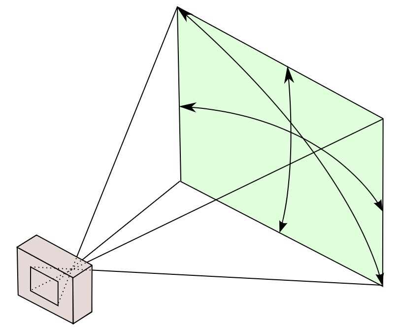
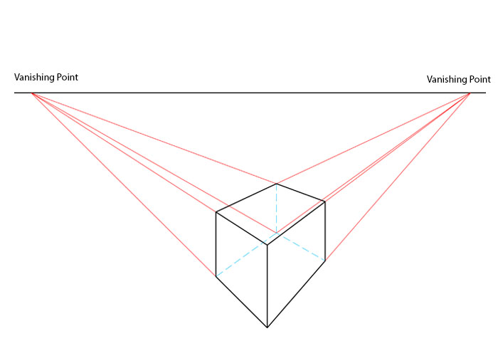

# Triangles on Web Ch5 Perspective Projection

In this chapter, we learn about perspective projection, which is the most common way to render 3D objects.

In this chapter, we will also learn about the clip space of the WebGPU, the camera system and the perspective projection.

## Clip Space

We previously learnt that the normalized device coordinates (NDC) is adopted in the WebGPU, but how exactly does NDC work?

During rendering, first off, the points are four dimensional, and the fourth dimension is the homogeneous coordinate, which is used to perform perspective division, a topic we will discuss later. Simply, the renderer transforms four-dimensional points to three-dimensional points by dividing the first three dimensions by the fourth dimension. That is, $(x, y, z, w)$ to $ (\frac{x}{w}, \frac{y}{w}, \frac{z}{w})$.

After perspective division, the points are in the clip space. Which means, the points exceeds the range of zero to one on x or y axis will be removed, and the points with negative z value or z value larger than one (after these values are divided by w) will be removed.

Then, the vertices are converted into primitives, and sends each pixel to the fragment shader for rendering.

If you enabled depth testing, the render will take the z-axis as the depth by default- but caution that points with z smaller than zero or larger than one will be removed, so you need to get around the depth a bit.

That is, you can change our previous code into this one with same result- instead of manually calculating the depth, we just use native z-axis as the depth.

```wgsl
@group(0) @binding(0) var<uniform> projection: mat3x2<f32>;
@group(0) @binding(1) var<uniform> angle: f32;

struct VertexOutput {
    @builtin(position) pos: vec4f,
    @location(0) @interpolate(flat) face: u32,
    @location(1) depth: f32,
};

@vertex
fn vertexMain(@location(0) position: vec3f, @builtin(vertex_index) vertexIndex: u32) -> VertexOutput {

    let rotation = mat3x3<f32>(
        vec3<f32>(cos(angle), 0.0, sin(angle)),
        vec3<f32>(0.0, 1.0, 0.0),
        vec3<f32>(-sin(angle), 0.0, cos(angle))
    );

    let rotated = rotation * position;

    let projected = projection * rotated;
    let final_position = vec4<f32>(projected, rotated.z * 0.25 + 0.25, 1.0);
    let depth = rotated.z * 0.5 + 0.5;

    var output = VertexOutput(final_position, vertexIndex / 6, depth);
    return output;
}

struct FragmentOutput {
    @location(0) color: vec4<f32>,
    // @builtin(frag_depth) depth: f32,
};

@fragment
fn fragmentMain(input: VertexOutput) -> FragmentOutput {
    var output = FragmentOutput(vec4<f32>(1.0, 1.0, 1.0, 1.0));
    if (input.face == 0u) {
        output.color = vec4<f32>(1.0, 0.0, 0.0, 1.0);
    } else if (input.face == 1u) {
        output.color = vec4<f32>(0.0, 1.0, 0.0, 1.0);
    } else if (input.face == 2u) {
        output.color = vec4<f32>(0.0, 0.0, 1.0, 1.0);
    } else if (input.face == 3u) {
        output.color = vec4<f32>(1.0, 1.0, 0.0, 1.0);
    } else if (input.face == 4u) {
        output.color = vec4<f32>(1.0, 0.0, 1.0, 1.0);
    } else {
        output.color = vec4<f32>(0.0, 1.0, 1.0, 1.0);
    }
    return output;
}
```

## Camera System

A camera is something that captures the scene, and the camera system is a system that simulates the camera in the 3D world.

In the previous chapter, we used the rotation matrix to rotate the object. Of course, you can also translate the object by adding a translation matrix. Of course, such things are useful, but more often, we take a different approach- albeit the same result- by moving the camera instead of the object.

A camera usually has its position, direction and field of view. The position is the position of the camera, the direction is the direction the camera is facing, and the field of view is the angle of the camera's view, that is, how wide the camera can see.



The field of view is usually measured in how large the screen the camera can see at the distance of one unit.

After introducing the camera, instead of using the raw points to render, we use the points relative to the camera.

This transformation is called the view transformation, which is actually three steps, translation, rotation and scaling.

### Translation

It's simple, the translated position is simply the original position minus the camera's position.

$$
r_{\text{translated}} = r_{\text{original}} - r_{\text{camera}}
$$

### Rotation

The rotation is a bit more complicated. On the simple side, you just need to rotated the $r_{\text{translated}}$ by the inverse of the camera's rotation. By complicated, it is that you need to determine a rotation matrix that inverts the camera's rotation matrix.

This depends on how you describe the rotation. A typical way would be the Euler angles- which implies that the rotation is done three times that are orthogonal between each two processes.

The most common way is the ZYX order, it contains three rotations. Please note that as the object rotates, there is something called local axis and global axis. The local axis is the axis of the object, which follows the same rotation as the object, while the global axis is the axis of the world, which is fixed. At first, the local axis is the same as the global axis, but as the object rotates, the local axis changes.

The following 

1. Yaw, the object rotates around the local z-axis.
2. Pitch, the object rotates around the local y-axis.
3. Roll, the object rotates around the local x-axis.

If the angles are respectively $\alpha$, $\beta$ and $\gamma$, the rotation matrix is the product of the three rotation matrices.

If we suppose the rotation matrix is $R$, that is, for the camera,

$$
d_{\text{camera}} = R \cdot (0, 0, 1)
$$

Then for the object, the rotation matrix is $R^{-1}$, that is,

$$
r_{\text{rotated}} = R^{-1} \cdot r_{\text{translated}}
$$

### Scaling

The scaling is simple, remember the field of view? By default, our field of view is two. So if we want a view of width $f_w$ and of height $f_h$,

$$
r_{\text{scaled}} = (\frac{r_{\text{rotated}}}{2 * f_w}, \frac{r_{\text{rotated}}}{2 * f_h}, r_{\text{rotated}})
$$

## Perspective Projection

Now we know what a three-dimensional point should be transformed based on a camera, now we need to project the three-dimensional point to the two-dimensional scene the camera is facing.

We already did that via orthographic projection, but it just sees not real- the reason was already addressed by artists in the Renaissance, that is, the perspective. Again, we do not explain what is perspective- we only talks about the math of it.

### Perspective Division

We know that parallel lines should merge into one point in the distance, and the point is called the vanishing point. If the parallel lines rotates along the direct-up axis, the vanishing point will move along the x-axis, this is called the view horizon.



This is from the view of lines. However, in computer graphics, we usually use the point-wise view of perspective.

That is, there is a global vanishing point, where it radiates straight lines. There also exists a screen before the vanishing point, and then the camera looks at the screen. For a point in the 3D space, it's 2D projection on the screen is the intersection of the screen and a straight line that goes through the point and the vanishing point.

Let's suppose the horizon is at the distance of $f$, relative to the camera, and stays at $y_{\text{horizon}}$ on the screen, which is also relative to the camera. 

Now, let's consider a point $(x, y, z)$, relative to the camera, we need to project it onto the screen, where z is zero. That is, we want to ask for $(x_s, y_s, 0)$, a straight line determined by $(x, y, z)$ and $(x_s, y_s, 0)$ goes right through the $(0, y_{\text{horizon}}, f)$.

So, we have

$$
\frac{x_s}{x} = \frac{f}{f - z}
$$

and,

$$
\frac{y_s - y_\text{horizon}}{y - y_\text{horizon}} = \frac{f}{f - z}
$$

More commonly we take $y_{\text{horizon}}$ as zero,

$$
\frac{y_s}{y} = \frac{f}{f - z}
$$

This is called the perspective division, and the $f$ is the focal length of the camera.

Please note that, this only considers the further-smaller role along the z-axis rotation. Only x-axis and y-axis has a perspective division, the z-axis does not.

If you also want z-axis to have a perspective division, there are many more complex methods, which are too much for this chapter and we won't talk about it.

### Using Homogeneous Coordinates for Perspective Division

Now, as you many have seen, we need division in the perspective division. However, division is bad because we prefer multiplication or addition. A way to get around is to use homogeneous coordinates.

We already talked about how homogeneous coordinates work in the previous chapter, $(x, y, z, w)$ is the same as $(\frac{x}{w}, \frac{y}{w}, \frac{z}{w})$.

So, instead of doing division, we can use a matrix that manipulates the fourth dimension to do the division for us.

That is, if we take the vector relative to the vanish point as $r_{\text{vanish}} = r_{\text{rotated}} - (0, y_{\text{horizon}}, f)$, we can use the following matrix to do the perspective division,

$$
r_{\text{projected vanish}} = \begin{bmatrix}
-f & 0 & 0 & 0 \\
0 & -f & 0 & 0 \\
0 & 0 & -f & 0 \\
0 & 0 & 1 & 0
\end{bmatrix} \cdot r_{\text{vanish}}
$$

Note that we ignores z-axis value all together- it is a fixed value. Because it represents the depth of the point. Technically, the projected z-axis should stay $-f$ based on the coordinate system with vanishing point as origin- but it doesn't matter.

If we expand the matrix multiplication, we get,

$$
(-f \cdot x, -f \cdot y, -f (z-f), z - f) = \begin{bmatrix}
-f & 0 & 0 & 0 \\
0 & -f & 0 & 0 \\
0 & 0 & -f & 0 \\
0 & 0 & 1 & 0
\end{bmatrix} \cdot (x, y, z - f, 1)
$$

After converting the homogeneous coordinates back to the Cartesian coordinates, we get,

$$
(-\frac{f \cdot x}{z - f}, -\frac{f \cdot y}{z - f}, -f)
$$

Which is exactly the perspective division we want.

## Show the Cube in Perspective

Previously, we have,

```wgsl
@group(0) @binding(0) var<uniform> projection: mat3x2<f32>;
@group(0) @binding(1) var<uniform> angle: f32;

struct VertexOutput {
    @builtin(position) pos: vec4f,
    @location(0) @interpolate(flat) face: u32,
};

@vertex
fn vertexMain(@location(0) position: vec3f, @builtin(vertex_index) vertexIndex: u32) -> VertexOutput {

    let rotation = mat3x3<f32>(
        vec3<f32>(cos(angle), 0.0, sin(angle)),
        vec3<f32>(0.0, 1.0, 0.0),
        vec3<f32>(-sin(angle), 0.0, cos(angle))
    );

    let rotated = rotation * position;

    let projected = projection * rotated;
    let depth = rotated.z * 0.25 + 0.25;
    let final_position = vec4<f32>(projected, depth, 1.0);

    var output = VertexOutput(final_position, vertexIndex / 6);
    return output;
}

struct FragmentOutput {
    @location(0) color: vec4<f32>,
};

@fragment
fn fragmentMain(input: VertexOutput) -> FragmentOutput {
    var output = FragmentOutput(vec4<f32>(1.0, 1.0, 1.0, 1.0));
    if (input.face == 0u) {
        output.color = vec4<f32>(1.0, 0.0, 0.0, 1.0);
    } else if (input.face == 1u) {
        output.color = vec4<f32>(0.0, 1.0, 0.0, 1.0);
    } else if (input.face == 2u) {
        output.color = vec4<f32>(0.0, 0.0, 1.0, 1.0);
    } else if (input.face == 3u) {
        output.color = vec4<f32>(1.0, 1.0, 0.0, 1.0);
    } else if (input.face == 4u) {
        output.color = vec4<f32>(1.0, 0.0, 1.0, 1.0);
    } else {
        output.color = vec4<f32>(0.0, 1.0, 1.0, 1.0);
    }
    return output;
}
```

Now, we need to change how `let projected = projection * rotated;` works, rotated is a three dimensional vector, and we need to convert it to a four dimensional vector. We can do this by adding a one at the end of the vector.

```wgsl
let rotated = vec4<f32>(rotation * position, 1.0);
```

Then, we need to change the projection matrix. We change the projection matrix into a four by four matrix,

```wgsl
@group(0) @binding(0) var<uniform> projection: mat4x4<f32>;
```

Then do our previously said transformation. Please note the depth calculation, where we use world z-axis (you haven't forgot world axis, right?) to calculate the depth.

```wgsl
@group(0) @binding(0) var<uniform> projection: mat4x4<f32>;
@group(0) @binding(1) var<uniform> angle: f32;

struct VertexOutput {
    @builtin(position) pos: vec4f,
    @location(0) @interpolate(flat) face: u32,
};

@vertex
fn vertexMain(@location(0) position: vec3f, @builtin(vertex_index) vertexIndex: u32) -> VertexOutput {

    let rotation = mat3x3<f32>(
        vec3<f32>(cos(angle), 0.0, sin(angle)),
        vec3<f32>(0.0, 1.0, 0.0),
        vec3<f32>(-sin(angle), 0.0, cos(angle))
    );

    let rotated = vec4<f32>(rotation * position, 1.0);
    var projected = projection * (rotated - vec4<f32>(0.0, 0.0, 2.0, 0.0));
    let final_position = vec4<f32>(projected.xy, 1.0 - rotated.z, projected.w);

    var output = VertexOutput(final_position, vertexIndex / 6);
    return output;
}

struct FragmentOutput {
    @location(0) color: vec4<f32>,
};

@fragment
fn fragmentMain(input: VertexOutput) -> FragmentOutput {
    var output = FragmentOutput(vec4<f32>(1.0, 1.0, 1.0, 1.0));
    if (input.face == 0u) {
        output.color = vec4<f32>(1.0, 0.0, 0.0, 1.0);
    } else if (input.face == 1u) {
        output.color = vec4<f32>(0.0, 1.0, 0.0, 1.0);
    } else if (input.face == 2u) {
        output.color = vec4<f32>(0.0, 0.0, 1.0, 1.0);
    } else if (input.face == 3u) {
        output.color = vec4<f32>(1.0, 1.0, 0.0, 1.0);
    } else if (input.face == 4u) {
        output.color = vec4<f32>(1.0, 0.0, 1.0, 1.0);
    } else {
        output.color = vec4<f32>(0.0, 1.0, 1.0, 1.0);
    }
    return output;
}
```

Then change the projection matrix,


```typescript
const f = 2;
const projectionMatrix = new Float32Array([
    -f, 0, 0, 0,
    0, -f, 0, 0,
    0, 0, 0, -f,
    0, 0, 1, 0,
]);
const projectionBuffer = device.createBuffer({
    size: 4 * 4 * 4,
    usage: GPUBufferUsage.UNIFORM | GPUBufferUsage.COPY_DST,
});
```

Now you should see a very realistic, nice cube in perspective. Adding with our previous chapter, you can rotate the cube.

You can also move the cube with,

```wgsl
let rotated = vec4<f32>(rotation * (position - vec3f(0.4, 0.4, 0.0)), 1.0);
```
