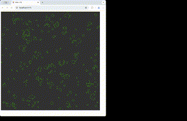
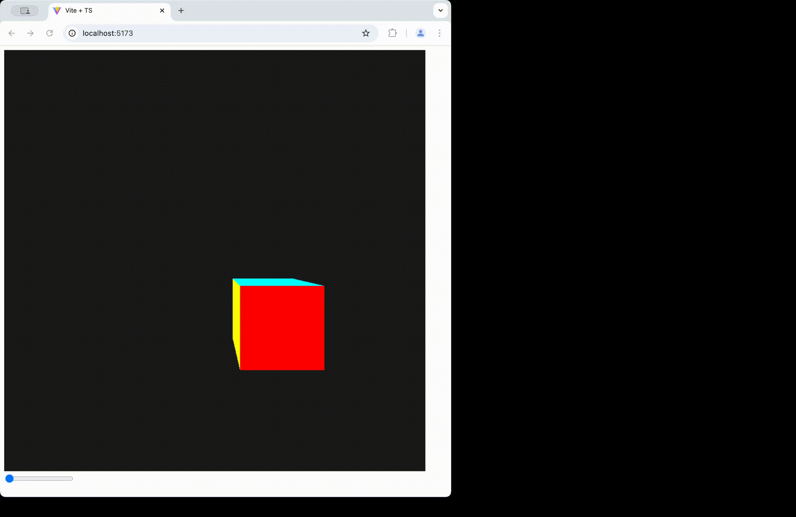
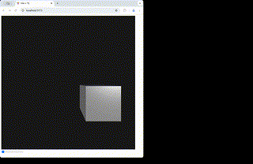
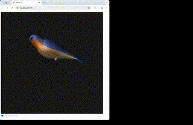

# Triangles on Web

This is a series of tutorial about computer graphics and WebGPU.

## What You Can Build

## 2D Basics

In this section, we learn about the basic concepts of computer graphics and WebGPU.

We do so by building a simple game called Life Game.

1. [Basic Setup](./notes/01.md)
2. [Life Game](./notes/02.md)
3. [Texture](./notes/03.md)

## 3D Basics

In this section, we learn about rendering 3D objects with WebGPU.

We first learn about the basic concepts of 3D rendering.

4. [Orthographic Projection](./notes/04.md)
5. [Perspective Projection](./notes/05.md)
6. [Lighting](./notes/06.md)

## WGSL

Then we talk about the elephant in the room- the shader language, wgsl.

7. [WGSL](./notes/07.md)

## 3D Models

This part familiarize you with OBJ file format and how to load 3D models.

8. [OBJ Model](./notes/08.md)

## Curves and Surfaces

Next part is about curves and surfaces.

9. [Bézier Curve, B-spline Curve, and Surface](./notes/09.md)
